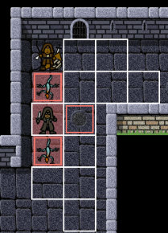

# Welcome

Hi! Welcome to Henspace.com. This is just a portal pointing to a variety of
projects I'm working on. Feel free to take a look around.

# Games and apps

## Click and crawl

Click and Crawl is an old-school dungeon crawler for quick, casual dungeon explorations. You have been asked by your fellow townsfolk to enter the dungeons and send back as much gold as you can via the ancient dwarven portals that are reported to exist within the dungeons' unforgiving walls. The elders will explain more.

[Click and Crawl](https://henspace.itch.io/click-and-crawl)

## RapidQandA

RapidQandA is an application that has been designed to take plain text files and convert them into quizzes and lessons. It's free, with no account needed and no ads.

[RapidQandA](https://henspace.github.io/text2lesson-docs/)

# Drawings

If you're interested in what sort of things I draw, take a look at my other social media sites or my [Redbubble](https://henspace.redbubble.com) shop.

 [Redbubble shop](https://henspace.redbubble.com)

# Webtoons comics

I've also been working on a number of comics which are all freely available at Webtoons.

[Webtoons comics](https://www.webtoons.com/en/creator/u93vy)

# Too many owls: a children's story

This is a story for children up to about 3 or 4. It's free and slightly interactive.

[Too many owls](https://henspace.com/games/toomanyowls/index.html)

It's also available from [Amazon](https://www.amazon.co.uk/Are-there-many-owls-bears/dp/B08L8SNLX8) if you'd like to support my work. It's pretty much the same as the online version but it includes a similar story about some cute bears.

[Home](index.md) | [About](about.md) | [Privacy](privacy.md)
